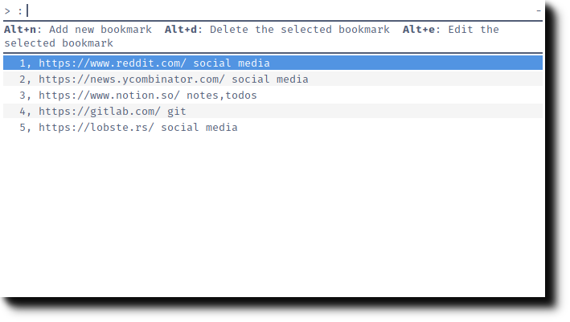

# Marcador

minimal bookmark manager

## Install
	$ pip install marcador

## Usage
CLI interface
	$ marcador --help

	Usage: marcador [OPTIONS] COMMAND [ARGS]...
	
	Options:
	  --help  Show this message and exit.
	
	Commands:
	  add
	  bookmark
	  edit
	  html
	  open
	  print
	  remove
	  rofi
	  tag-search
	  url

Rofi interface

	$ marcador rofi <bookmark file>

## Thanks
This project is heavily inspired by [buku](https://github.com/jarun/Buku)

## Screenshots

