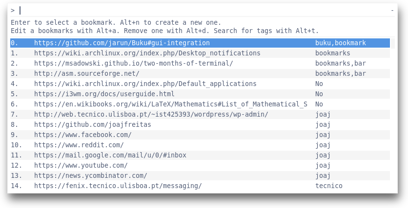

# Marcador

minimal bookmark manager

## Install
	$ git clone git@github.com:joajfreitas/marcador.git
	$ cd marcador

## Usage
CLI interface

	$ marcador -h

Rofi interface

	$ rofi-marcador

## Thanks
This project is heavily inspired by [buku](https://github.com/jarun/Buku)

## Screenshots

