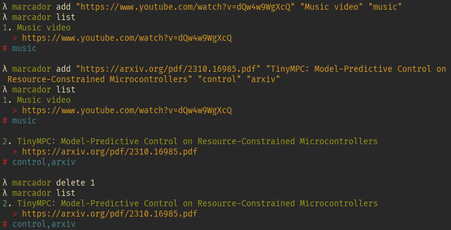
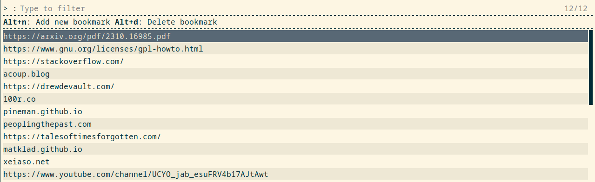

# Marcador

Minimal bookmark manager

## Install

	$ cargo install --path .

## Usage

CLI interface

```bash
Usage: marcador [OPTIONS] <COMMAND>

Commands:
  rofi    Rofi interface
  add     Add a new bookmark
  list    List bookmarks
  delete  Delete bookmark by id
  help    Print this message or the help of the given subcommand(s)

Options:
      --host <HOST>  Hostname of marcador server
      --db <DB>      Bookmark batabase path
  -h, --help         Print help
  -V, --version      Print version
```




### Configuration

The marcador database location can be configured in `$XDG_CONFIG_HOME/marcador/marcador.toml`.

```toml
# local database
db = "/home/quux/marcador.db" 
# remote marcador server
# host = "https://quux.com/marcador" 
```

Only one of db and host should be configured.

The configuration file options can be overriden by the `--host` and `--db` marcador options.

## Server

```bash
Usage: marcador_server [OPTIONS]

Options:
      --db <DB>
      --host <HOST>
      --port <PORT>
      --root <ROOT>
  -h, --help         Print help
  -V, --version      Print version
```

marcador_server provides remote access to a marcador database.

Example nginx reverse proxy:
```
location /marcador {
        proxy_pass http://127.0.0.1:8080;
        proxy_redirect off;
        proxy_set_header Host $host;
        proxy_set_header X-Real-IP $remote_addr;
        proxy_set_header X-Forwarded-For $proxy_add_x_forwarded_for;
        proxy_set_header X-Forwarded-Proto $scheme;
}
```

### Configuration

```toml
[server]
host = "127.0.0.1"
port = 8080
db = "/home/quux/marcador.db"
root = "/"
```

## Thanks
This project is heavily inspired by [buku](https://github.com/jarun/Buku)

## Screenshots

